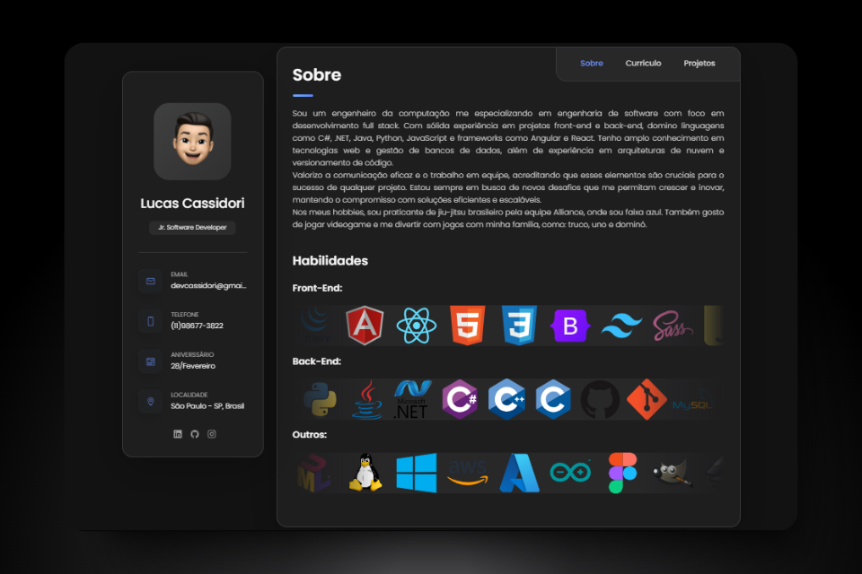

# 💻 Lucas Cassidori - Site Pessoal

[](http://devcassidori.com.br)
[](https://developer.mozilla.org/en-US/docs/Web/HTML)
[](https://developer.mozilla.org/en-US/docs/Web/CSS)
[](https://developer.mozilla.org/en-US/docs/Web/JavaScript)

> **Portfólio profissional completo desenvolvido como SPA (Single Page Application) para apresentar minha trajetória como Engenheiro de Software Full Stack.**

🌐 **[Acessar Site](http://devcassidori.com.br)**

## � Sobre o Projeto

Este projeto é meu portfólio pessoal desenvolvido com foco em **performance**, **responsividade** e **experiência do usuário**. O site apresenta uma interface moderna e intuitiva, utilizando animações suaves e um design clean para destacar minha trajetória profissional e projetos desenvolvidos.

### ✨ Principais Funcionalidades

- 🙋‍♂️ **Seção "Sobre"**: Apresentação pessoal com animações de tecnologias em carrossel
- 📄 **Currículo Interativo**: Timeline detalhada com experiências, educação e certificações
- 🚀 **Galeria de Projetos**: Showcase dos principais projetos com links diretos
- 📱 **Design Responsivo**: Adaptação perfeita para desktop, tablet e mobile
- 🎨 **Animações Suaves**: Transições e efeitos visuais com ScrollReveal
- 📧 **Contatos Integrados**: Links diretos para email, WhatsApp e redes sociais
- 📥 **Download do CV**: Acesso direto ao currículo em PDF

## 🛠️ Tecnologias Utilizadas

### Frontend

- **HTML5** - Estrutura semântica
- **CSS3** - Estilização avançada com Flexbox e Grid
- **JavaScript (ES6+)** - Interatividade e manipulação do DOM
- **ScrollReveal.js** - Animações de entrada

### Design & UX

- **Google Fonts (Poppins)** - Tipografia moderna
- **Ionicons** - Ícones vetoriais
- **Design Responsivo** - Mobile-first approach
- **Paleta de cores personalizada** - Tema escuro elegante

## 🎨 Demonstração Visual



### 📱 Seções do Site

| Seção | Descrição |
|-------|-----------|
| **Sobre** | Apresentação pessoal, habilidades técnicas em carrossel animado |
| **Currículo** | Timeline interativa com formação, experiências e certificações |
| **Projetos** | Grid responsivo com projetos desenvolvidos |

## 🏗️ Estrutura do Projeto

```text
MeuSite/
├── 📄 index.html           # Página principal (SPA)
├── 📄 CNAME               # Configuração do domínio personalizado
├── 📁 assets/
│   ├── 📁 css/
│   │   └── style.css      # Estilos principais
│   ├── 📁 js/
│   │   └── script.js      # Lógica e interatividade
│   ├── 📁 images/         # Imagens e screenshots dos projetos
│   └── 📄 CV Lucas Cassidori.pdf  # Currículo para download
└── 📄 readme.md           # Documentação do projeto
```

## 🚀 Como Executar Localmente

1. **Clone o repositório**

   ```bash
   git clone https://github.com/devcassidori/MeuSite.git
   cd MeuSite
   ```

2. **Abra o projeto**
   - Abra o arquivo `index.html` em seu navegador
   - Ou use um servidor local como Live Server (VS Code) ou Python SimpleHTTPServer

3. **Servidor local (opcional)**

   ```bash
   # Python 3
   python -m http.server 8000
   
   # Python 2
   python -m SimpleHTTPServer 8000
   
   # Node.js (npx)
   npx serve .
   ```

## 📊 Métricas e Performance

- ✅ **100% Responsivo** - Testado em dispositivos móveis e desktop
- ⚡ **Carregamento Rápido** - Otimizado para velocidade
- 🎯 **SEO Friendly** - Meta tags e estrutura semântica
- ♿ **Acessibilidade** - Seguindo boas práticas de UX/UI
- 🌐 **Cross Browser** - Compatível com navegadores modernos

## 🔧 Funcionalidades Técnicas

- **Single Page Application (SPA)** com navegação fluida
- **Animações CSS** e **JavaScript** para melhor experiência
- **Carrossel de tecnologias** com movimento contínuo
- **Timeline interativa** para experiências profissionais
- **Modal e overlays** para melhor organização do conteúdo
- **Sidebar responsiva** com informações de contato

## 📈 Próximas Atualizações

- [ ] Implementação de tema claro/escuro
- [ ] Mais projetos e case studies
- [ ] Versão em inglês

## 📞 Contato

- 📧 **Email**: [devcassidori@gmail.com](mailto:devcassidori@gmail.com)
- 💼 **LinkedIn**: [Lucas Cassidori](https://www.linkedin.com/in/lucascassidori/)
- 🐱 **GitHub**: [devcassidori](https://github.com/devcassidori)
- 📱 **WhatsApp**: [(11) 98677-3822](https://wa.me/5511986773822)
- 🌐 **Site**: [devcassidori.com.br](http://devcassidori.com.br)

## 📄 Licença

Este projeto está sob a licença MIT. Veja o arquivo [LICENSE](LICENSE) para mais detalhes.

---
